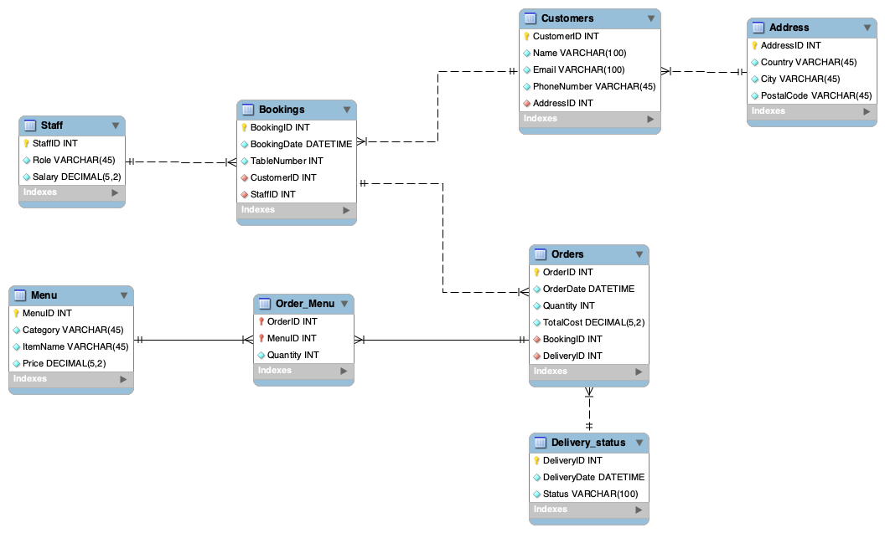

# Coursera Meta Database Engineering Capstone Project

## Create an ER diagram data model and implement it in MySQL
Little Lemon needs to build a robust relational database system in
MySQL in which they can store large amounts of data.  They then need
to easily manage and find this data as required. This database system
should maintain information about the following aspects of the
business:

- Bookings.
- Orders.
- delivery status.
- Menu.
- Customer details.
- Staff information.

### Task 1
Create a normalized ER diagram (that adheres to 1NF, 2NF and 3NF) with
relevant relationships to meet the data requirements of Little Lemon.



Now Using the Forward Engineering we can create the DB schema.
In the SQL workbench run the following code to get the tables

```
	USE LittleLemonDB;

	SHOW TABLES;
```
